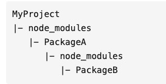
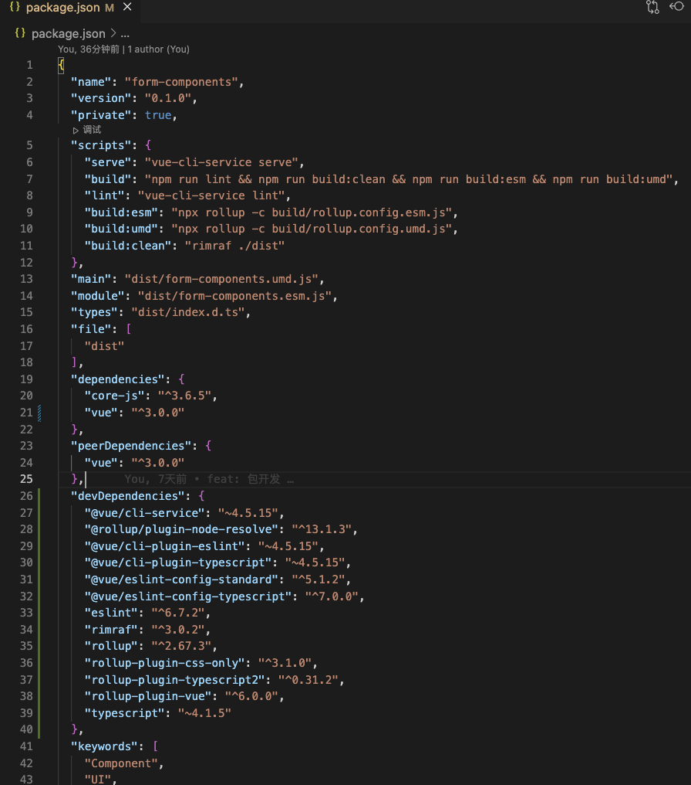
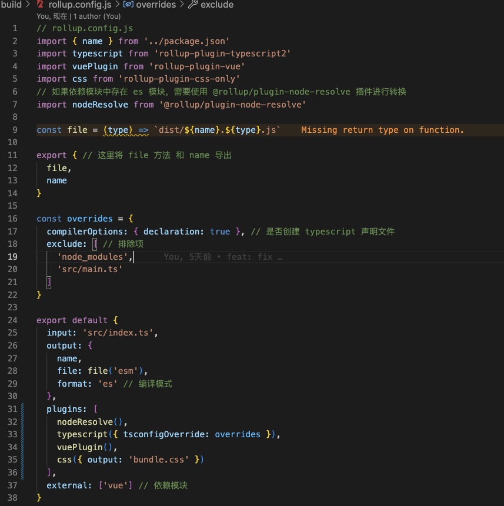
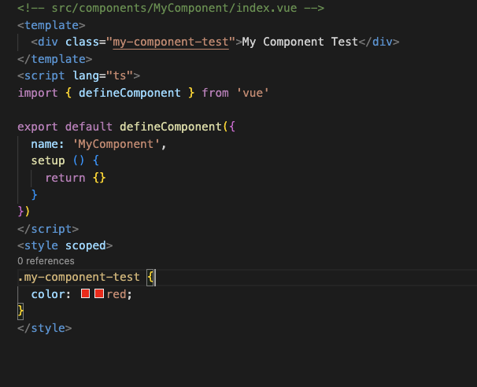
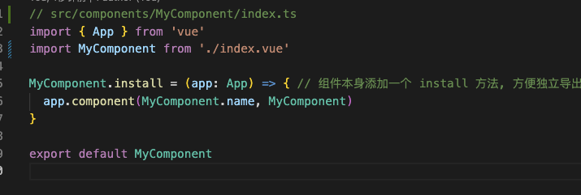
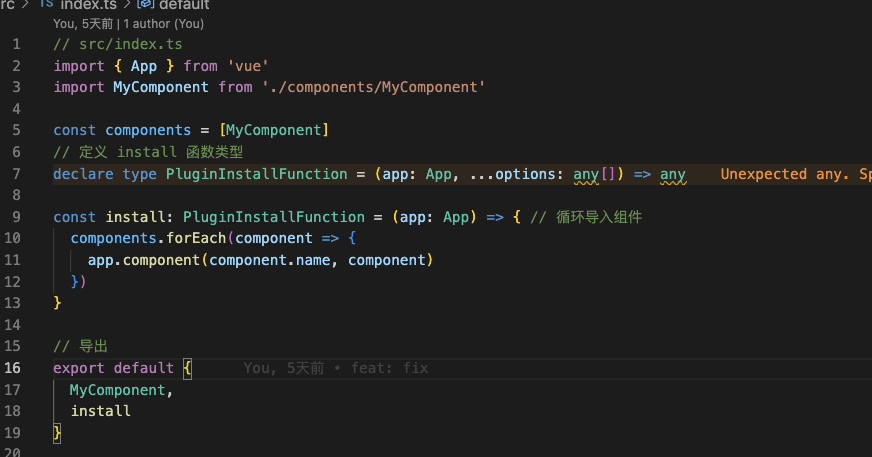

# 从零开始拥有一个自己的npm包

- [从零开始拥有一个自己的npm包](#从零开始拥有一个自己的npm包)
  - [1.npm包](#1npm包)
    - [打包](#打包)
    - [加载规则](#加载规则)
    - [发布的文件](#发布的文件)
    - [项目依赖](#项目依赖)
    - [版本号规范](#版本号规范)
  - [2.npm包开发](#2npm包开发)
    - [组件开发及入口](#组件开发及入口)
    - [本地测试](#本地测试)
    - [打包发布](#打包发布)
  - [项目地址](#项目地址)

## 1.npm包

  遇到重复的功能的时候，避免去其他项目拷贝代码，且无法实时更新功能时，就可以考虑把当前的功能作为一个npm包来开发。

### 打包

  和普通的前端项目是一样的，npm包也需要打包，因为实际情况下，很多项目会应用到typescript、babel、eslint、代码压缩等等功能，所以npm包最好也是打包后发布。

  webpack,rollup,parcel等等打包工具，选用rollup是因为webpack比较重，npm打包后的目录可能会包含webpack自身的处理逻辑，引起不必要的体积增大（虽然实际增大的也不会太多），轻巧的rollup相对比较适合用来打包npm。

### 加载规则

  npm包为了支持多种环境，比如浏览器、服务器等等，在项目进行加载的时候，单入口文件就不能满足，这里就需要用到package.js里面的main、jsnext:main、module、browser等字段，去配置对应的入口。

### 发布的文件

在npm中，可以指定哪些文件发布到服务器。一般分为这几种情况。

- 存在.npmignore文件，以.npmignore文件为准，在文件中的内容都会被忽略，不会上传；即使有.gitignore文件，也不会生效。
- 不存在.npmignore文件，以.gitignore文件为准，一般是无关内容，例如.vscode等环境配置相关的。
- 不存在.npmignore也不存在.gitignore，所有文件都会上传。
  
### 项目依赖

 在package.json文件中，所有的依赖包都会在dependencies和devDependencies字段中进行配置管理：

- dependencies：表示生产环境下的依赖管理，--save 简写 -S；
- devDependencies：表示开发环境下的依赖管理，--save-dev 简写 -D；
- peerDependencies 重复包依赖管理。



### 版本号规范
  
  版本格式为：major.minor.patch

- 主版本号(major)：当你做了不兼容的API修改
- 次版本号(minor)：当你做了向下兼容的功能性新增
- 修订号(patch)：当你做了向下兼容的问题修正

先行版本号是加到修订号的后面，作为版本号的延伸；当要发行大版本或核心功能时，但不能保证这个版本完全正常，就要先发一个先行版本。

先行版本号的格式是在修订版本号后面加上一个连接号（-），再加上一连串以点（.）分割的标识符，标识符可以由英文、数字和连接号（[0-9A-Za-z-]）组成。
例如：

- 1.0​​.0-alpha
- 1.0.0-alpha.1
- 1.0.0-0.3.7

先行版本号有：

- alpha：不稳定版本，一般而言，该版本的Bug较多，需要继续修改，是测试版本
- beta：基本稳定，相对于Alpha版已经有了很大的进步，消除了严重错误
- rc：和正式版基本相同，基本上不存在导致错误的Bug
- release：最终版本

**版本号唯一，每次更新需手动更新版本号，更新当前版本号时需要对下面所有的版本号进行重置为0。**

[rollup打包相关插件](https://github.com/rollup/awesome)

## 2.npm包开发

 基于现在我们开发的vue3一些公共组件，以最简单的input组件来开发

### 组件开发及入口

- 初始化vuex项目

``` js
  vue create npm-demo
```

- package.json

**注意为开发依赖，记得加上 --save-dev**


- rollup.config.js



  MyComponent/index.ts

- 创建对应的测试组件及入口
  ComponentTest/index.vue
 
  MyComponent/index.ts
 
 src/index.ts
 

- 项目中引用

 

### 本地测试

- 当前的组件项目中 运行 npm link
 当前指令是将当前目录挂载到全局，苹果的系统可能没有系统目录权限，需要在前面加 sudo 指令

- 测试项目中 运行 npm link 组件项目名， node_modules依赖指向全局目录

### 打包发布

npm run build 打包好就可以开始发布了。

我们需要自己在<https://www.npmjs.com/>注册自己的账号

用npm在本地管理自己的账号

``` js
npm adduser --registry=http://registry.npmjs.org/

// 登陆 登出
npm login
npm logout
// 查看当前用户
npm who am i
// 发布
npm publish
// 撤回版本
npm unpublish [pkg]@[version]
```

由于我们的镜像多数是指向淘宝的镜像的，需要在账户登陆时切换回npm的镜像

``` js
npm config set registry https://registry.npmjs.org/

npm config set registry  https://registry.npm.taobao.org/

```

## 项目地址

附一个组件库的地址，大家有空自己照着试试
地址 <https://github.com/futingting/form-components>
