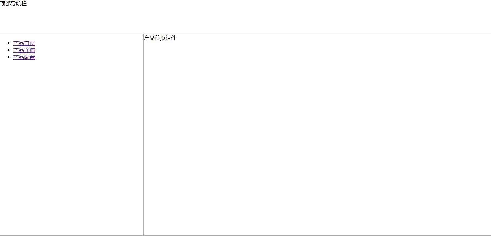

# 目录
- [简介](#简介)
- [基本使用流程](#基本使用流程)
- [动态路由 (路由传参)](#动态路由)
- [路由嵌套](#路由嵌套)
- [编程式导航](#编程式导航)
- [命名路由](#命名路由)
- [命名视图](#命名视图)


# 简介
## vue-router的优点
  ### 01.Vue在开发时对路由支持的不足。
  ### 02.vue的单页面应用是基于路由和组件的，路由用于设定访问路径，可以将路径和组件映射起来。
  ### 03.在vue-router单页面应用中，路径之间的切换，实际上是组件的切换。
  ### 04.vue-router可以视为WebApp的链接路径管理系统，路由可视为SPA（单页应用）的路径管理器。
  ### 05.传统的页面应用，是用一些超链接来实现页面切换和跳转的，而Vue做的大多是单页应用，只有一个主页面index.html，<a></a>标签是不起作用的。


# 基本使用流程

## 1. 安装：npm install vue-router

## 2. 创建路由组件
```js
import Vue from 'vue' 
import Router from 'vue-router' //引入vue-router

Vue.use(Router)
// const originalPush = Router.prototype.push
// Router.prototype = function push(location) {
//     return originalPush.call(this, location).catch(err => err)
// }

const routes = [ // 准备路由组件
    {
        path: '/Login',
        name: 'login',
        component: () => import('../views/Login.vue')
    },
    {
        path: '/home',
        name: 'home',
        component: () => import('../views/Home.vue')
    },
    {
        path: '/main',
        name: 'main',
        component: () => import('../views/Main.vue')
    },
    {
        path: '/test',
        name: 'test',
        component: () => import('../views/Test.vue')
    }
]

const router = new Router({ routes }) //创建路由对象

export default router // 抛出
```
## 3. 向Vue实例中，注入VueRouter实例
```js
// import Vue from 'vue'
// import App from './App.vue'
// import Antd from 'ant-design-vue'
// import axios from 'axios'
import router from "./router/lazy"
// Vue.config.productionTip = false

// Vue.prototype.$axios = axios
// Vue.use(Antd)

new Vue({
  render: h => h(App),
  router,
}).$mount('#app')

```
## 4.router-link制作导航
```js
  <router-link to="/home">首页</router-link>
  <router-link to="/test">测试页</router-link>
  <router-link to="/login">登录页</router-link>
  <router-link to="/main">主页</router-link>
    //1.router-link 是一个组件，它默认会被渲染成一个带有链接的a标签，通过to属性指定链接地址。
    // 注意：被选中的router-link将自动添加一个class属性值.router-link-active。


    // 2.<router-link to="/">[text]<router-link/>
    // + to：导航路径，要填写的是你在router/index.js文件里配置的
    // + path值，如果要导航到默认首页，只需要写成 to="/" ，
    // [text] ：就是我们要显示给用户的导航名称。

  <router-view></router-view>
    // router-view 用于渲染匹配到的组件。
```


# 动态路由
  ## 1. 设置形参
  ```js
      {
        path:'/test/:id',
        component:Test
      }
  ```
  ## 2. 传递实参
  ```js
  <router-link to="/test/007">测试组件</router-link>
  ```
  ## 3. 在目标组件中，提取参数，并使用
  ```js
  let testData = this.$route.params;  //提取方式
  ```
  ## 4. 对应关系
  | 模式 | 匹配路径 | $route.params|
  | --- | --- | --- |
  | /test/:id  | /test/123 | { id: 123 } |
  | /test/:id/mode/:lay_out  | /test/123/mode/up_down | { id: 123, lay_out: up_down } |

# 路由嵌套

实际项目通常由多层嵌套的组件组合而成。同样地，URL 中各段动态路径也按某种结构对应嵌套的各层组件，例如：
```js
/user/foo/profile                     /user/foo/posts
+------------------+                  +-----------------+
| User             |                  | User            |
| +--------------+ |                  | +-------------+ |
| | Profile      | |  +------------>  | | Posts       | |
| |              | |                  | |             | |
| +--------------+ |                  | +-------------+ |
+------------------+                  +-----------------+
```
借助 vue-router，使用嵌套路由配置，就可以很简单地表达这种关系。

如果<router-view> 是最顶层的出口，渲染最高级路由匹配到的组件。同样地，一个被渲染组件同样可以包含自己的嵌套 <router-view>, 渲染与之匹配到的子组件。
```js

<div id="app">
  <router-view></router-view> // 这里的是最顶层的出口
</div>
const User = {
  template: '<div>User {{ $route.params.id }}</div>'
}

const router = new VueRouter({
  routes: [{ path: '/user/:id', component: User }]
})

// 在 User 组件的模板添加一个 <router-view>
// 渲染与之匹配到的子组件。
const User = {
  template: `
    <div class="user">
      <h2>User {{ $route.params.id }}</h2>
      <router-view></router-view>
    </div>
  `
}
```
要在嵌套的出口中渲染组件，需要在 VueRouter 的参数中使用 children 配置：

```js
const router = new VueRouter({
  routes: [
    {
      path: '/user/:id',
      component: User,
      children: [
        {
          // 当 /user/:id/profile 匹配成功，
          // UserProfile 会被渲染在 User 的 <router-view> 中
          path: 'profile',
          component: UserProfile
        },
        {
          // 当 /user/:id/posts 匹配成功
          // UserPosts 会被渲染在 User 的 <router-view> 中
          path: 'posts',
          component: UserPosts
        }
      ]
    }
  ]
})
```
要注意，以 / 开头的嵌套路径会被当作根路径。 这让你充分的使用嵌套组件而无须设置嵌套的路径。

你会发现，children 配置就是像 routes 配置一样的路由配置数组，所以呢，你可以嵌套多层路由。

此时，基于上面的配置，当你访问 /user/foo 时，User 的出口是不会渲染任何东西，这是因为没有匹配到合适的子路由。如果你想要渲染点什么，可以提供一个 空的 子路由：
```js
const router = new VueRouter({
  routes: [
    {
      path: '/user/:id',
      component: User,
      children: [
        // 当 /user/:id 匹配成功，
        // UserHome 会被渲染在 User 的 <router-view> 中
        { path: '', component: UserHome }

        // ...其他子路由
      ]
    }
  ]
})
```

# 编程式导航
除了使用 <router-link> 创建 a 标签来定义导航链接，我们还可以借助 router 的实例方法，通过编写代码来实现。

## 1.router.push()
在 Vue 实例内部，你可以通过 $router 访问路由实例。因此你可以调用 this.$router.push。


想要导航到不同的 URL，则使用 router.push 方法。这个方法会向 history 栈添加一个新的记录，所以，当用户点击浏览器后退按钮时，则回到之前的 URL。

当你点击 <router-link> 时，这个方法会在内部调用，所以说，点击 <router-link :to="..."> 等同于调用 router.push(...)。

  | 声明式 | 编程式 |
  | --- | --- |
  | `<router-link :to="...">`  | router.push(...) |

**注意：如果提供了 path，params 会被忽略，query 则不会。取而代之的是提供路由的 name 或手写完整的带有参数的 path：**
```js
const userId = '123'
router.push({ name: 'user', params: { userId }}) // -> /user/123
router.push({ path: `/user/${userId}` }) // -> /user/123
router.push({ path: 'user', query: { userId }}) // -> /user?userId=123
// 这里的 params 不生效
router.push({ path: '/user', params: { userId }}) // -> /user
```	
## 2.router.replace()
跟 router.push 很像，唯一的不同就是，它不会向 history 添加新记录，而是跟它的方法名一样 —— 替换掉当前的 history 记录。

  | 声明式 | 编程式 |
  | --- | --- |
  | `<router-link :to="..." replace>`  | router.replace(...) |

## 3.router.go(n)
这个方法的参数是一个整数，意思是在 history 记录中向前或者后退多少步，类似 window.history.go(n)。
```js

// 在浏览器记录中前进一步，等同于 history.forward()
router.go(1)

// 后退一步记录，等同于 history.back()
router.go(-1)

// 前进 3 步记录
router.go(3)

// 如果 history 记录不够用，那就默默地失败呗
router.go(-100)
router.go(100)
```
## 4.操作 History
你也许注意到 router.push、 router.replace 和 router.go 跟 window.history.pushState、 window.history.replaceState 和 window.history.go (opens new window)好像， 实际上它们确实是效仿 window.history API 的。

因此，如果你已经熟悉 Browser History APIs (opens new window)，那么在 Vue Router 中操作 history 就是超级简单的。

还有值得提及的，Vue Router 的导航方法 (push、 replace、 go) 在各类路由模式 (history、 hash 和 abstract) 下表现一致

# 命名路由
1. 为路由对象设置name
```
{
  path:'/test',
  name:'test',
  component:Test
},
```

2. 可以使用name切换路由

声明式
```js
<router-link :to="{ name: 'test', params: { testId: 123 }}">test007</router-link>
```
编程式
```js
  this.$router.push({
    name:test,
    params:{  //刷新后会丢失
      id:3333
    },
    query:{  //刷新后依旧可以保留
      num:100
    }
  })
```

# 命名视图
## 1. 介绍
下图页面想要点击aside切换页面，只有content区域更新                       
```js
+-----------------------------+                
| nav1                        |                
|----------- +--------------- |                 
|    aside1  | content        |          
|            |                |                 
|    aside2  |                |                 
|----------- +----------------|
```
这个时候命名视图就派上用场了。你可以在界面中拥有多个单独命名的视图，而不是只有一个单独的出口。如果 router-view 没有设置名字，那么默认为 default。

## 2. 路由对象的多组件配置
```js
{
  path:'/',
  components:{
    'nav':Nav,
    'aside':Aside,
    default:Content
  }
}
```

## 3. 使用多个命名的router-view渲染视图
```js
<router-view class="nav" name="nav"></router-view>
<router-view class="aside" name="aside"></router-view>
<router-view class=" content"></router-view>
```

## 4. 完整示例
```js
<div id="app">
  // 顶部导航栏
  <router-view name="nav">sdfgasg</router-view> 
  // 侧边导航栏
  <router-view name="aside"></router-view>
  // 不带名字渲染的就是default里面的东西
  <router-view></router-view>   
</div>

```
```js
  // 公共组件
  let Nav = {
    template:'<div class="nav">顶部导航栏</div>'
  }
  let Aside = {
    template:`<div class="aside">
              <ul>
                <li>
                  <router-link to="/">产品首页</router-link>
                </li>
                <li>
                  <router-link to="/detail">产品详情</router-link>
                </li>
                <li>
                  <router-link to="/config">产品配置</router-link>
                </li>
              </ul>
            </div>`
  }

  // 业务组件
  let Home = {
    template:'<div class="home">产品首页组件</div>'
  }
  let Detail = {
    template:'<div class="detail">产品详情组件</div>'
  }
  let Config = {
    template:'<div class="config">产品配置组件</div>'
  }
  let router = new VueRouter({
    routes:[
      {
        path:'/',
        components:{
          'nav':Nav,
          'aside':Aside,
          default:Home
        }
      },
      {
        path:'/detail',
        components:{
          'nav':Nav,
          'aside':Aside,
          default:Detail
        }
      },
      {
        path:'/config',
        components:{
          'nav':Nav,
          'aside':Aside,
          default:Config
        }
      }
    ]
  })
  new Vue({
    el:'#app',   //占地盘
    router,
    data:{      // 小金库
      'msg':'Hello'
    }
  })
```



