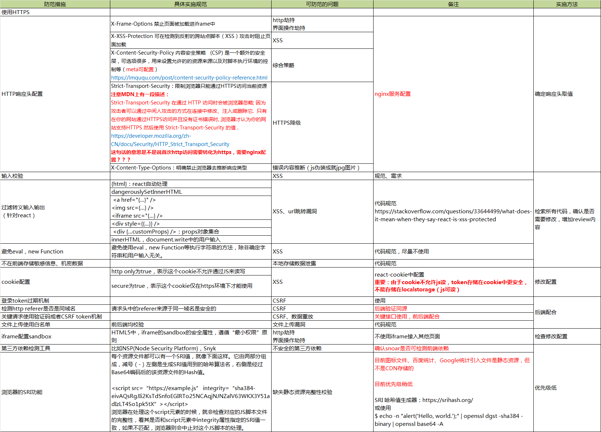

# 目录
- [简介](#简介)
- [常见前端安全问题](#常见前端安全问题)
  - [1. XSS攻击](#1-XSS攻击)
  - [2. iframe风险](#2-iframe风险)
  - [3. 点击劫持](#3-点击劫持)
  - [4. 错误的内容推断](#4-错误的内容推断)
  - [5. 不安全的第三方依赖包](#5-不安全的第三方依赖包)
  - [6. HTTPS变HTTP](#6-HTTPS变HTTP)
  - [7. 本地存储数据泄露](#7-本地存储数据泄露)
  - [8. 缺乏静态资源完整性校验](#8-缺乏静态资源完整性校验)
  - [9. CSRF攻击](#9-CSRF攻击)

<br/><br/>

# 简介
## 那么所有发生在后端服务器、应用、服务当中的安全问题就是“后端安全问题”，所有发生在浏览器、单页面应用、Web页面当中的安全问题则算是“前端安全问题”。
<br/><br/>

# 常见前端安全问题
+ 跨站脚本攻击(Cross-Site Scripting简称xss)
+ iframe风险
+ 点击劫持
+ 错误的内容推断
+ 不安全的第三方依赖包
+ HTTPS劫持
+ 本地存储数据泄露
+ 缺失静态资源完整性校验
+ CSRF（cross-site request forgery)跨站请求伪造
<br/><br/>

## 1. XSS攻击

> 即跨站脚本攻击(Cross-Site Scripting)，浏览器错误的将攻击者提供的用户输入数据当做JavaScript脚本给执行了。

### XSS分类

 按照恶意输入的脚本是否在应用中存储，XSS被划分为“存储型XSS”和“反射型XSS”，

 按照是否和服务器有交互，XSS被划分为“Server Side XSS”和“DOM based XSS”。

### 安全隐患

攻击者通过在目标网站上注入恶意脚本，使之在用户的浏览器上运行。利用这些恶意脚本，攻击者可获取用户的敏感信息如 Cookie、SessionID 等，进而危害数据安全。

### 防御措施

 防御XSS最佳的做法就是对数据进行严格的输出编码，使得攻击者提供的数据不再被浏览器认为是脚本而被误执行。
```js
例如<script>在进行HTML编码后变成了&lt;script&gt;，而这段数据就会被浏览器认为只是一段普通的字符串，而不会被当做脚本执行了。
```

编码需要根据输出数据所在的上下文来进行相应的编码。
```js
1-数据被放置于HTML元素，则进行HTML编码，放置于URL中，则进行URL编码，将其变为%3Cscript%3E。

2-此外，还有JavaScript编码、CSS编码、HTML属性编码、JSON编码等等。

3-前端开发框架基本上都默认提供了前端输出编码。

4-其他的防御措施，例如设置CSP HTTP Header、输入验证、开启浏览器XSS防御等等都是可选项，原因在于这些措施都存在被绕过的可能，并不能完全保证能防御XSS攻击。不过它们和输出编码却可以共同协作实施纵深防御策略。
```
<br/><br/>

## 2. iframe风险
> 有些时候我们的前端页面需要用到第三方提供的页面组件，通常会以iframe的方式引入。典型的例子是使用iframe在页面上添加第三方提供的广告、天气预报、社交分享插件等等。

### 安全隐患
+ 因为iframe中的内容是由第三方来提供的，默认情况下他们不受我们的控制，他们可以在iframe中运行JavaScirpt脚本、Flash插件、弹出对话框等等，这可能会破坏前端用户体验。
+ 如果iframe中的域名因为过期而被恶意攻击者抢注，或者第三方被黑客攻破，iframe中的内容被替换掉了，从而利用用户浏览器中的安全漏洞下载安装木马、恶意勒索软件等等

### 防御方法
> HTML5中，iframe有了一个叫做sandbox的安全属性，通过它可以对iframe的行为进行各种限制，充分实现“最小权限“原则。

使用sandbox的最简单的方式就是只在iframe元素中添加上这个关键词就好，如下：
```js
<iframe sandbox src="..."> ... </iframe>
```
sandbox也提供了丰富的配置参数，我们可以进行较为细粒度的控制。一些典型的参数如下：
```js
allow-forms：允许iframe中提交form表单
allow-popups：允许iframe中弹出新的窗口或者标签页（例如，window.open()，showModalDialog()，target=”_blank”等等）
allow-scripts：允许iframe中执行JavaScript
allow-same-origin：允许iframe中的网页开启同源策略
```

## 3. 点击劫持
> 我们在通过iframe使用别人提供的内容时，我们自己的页面也可能正在被不法分子放到他们精心构造的iframe或者frame当中，进行点击劫持攻击。

### 攻击步骤
```js
1.攻击者精心构造一个诱导用户点击的内容，比如Web页面小游戏
2.将我们的页面放入到iframe当中
3.利用z-index等CSS样式将这个iframe叠加到小游戏的垂直方向的正上方
4.把iframe设置为100%透明度
5.受害者访问到这个页面后，肉眼看到的是一个小游戏，如果受到诱导进行了点击的话，实际上点击到的却是iframe中的我们的页面
```

### 安全隐患
+ 攻击利用了受害者的用户身份，在其不知情的情况下进行一些操作

### 防御方法
```js
1.Frame Breaking方案。

2.使用X-Frame-Options：DENY这个HTTP Header来明确的告知浏览器，不要把当前HTTP响应中的内容在HTML Frame中显示出来。
```
## 4. 错误的内容推断
> 浏览器会根据响应内容来推断其类型，从而带来安全风险。

> 比如：攻击者在上传图片的时候，看似提交的是个图片文件，实则是个含有JavaScript的脚本文件。该文件逃过了文件类型校验，在服务器里存储了下来。接下来，受害者在访问图片的时候，浏览器会去请求这个伪装成图片的JavaScript脚本，而此时如果浏览器错误的推断了这个响应的内容类型（MIME types），那么就会把这个图片文件当做JavaScript脚本执行，于是攻击也就成功了。

> 问题的关键就在于，后端服务器在返回的响应中设置的Content-Type Header仅仅只是给浏览器提供当前响应内容类型的建议，而浏览器有可能会自作主张的根据响应中的实际内容去推断内容的类型。

> 在上面的例子中，后端通过Content-Type Header建议浏览器按照图片来渲染这次的HTTP响应，但是浏览器发现响应中其实是JavaScript，于是就擅自做主把这段响应当做JS脚本来解释执行，安全问题也就产生了。


### 安全隐患
+ 攻击利用了受害者的用户身份，在其不知情的情况下进行一些操作

### 防御方法
```js
1.通过设置X-Content-Type-Options这个HTTP Header明确禁止浏览器去推断响应类型。

浏览器发现有X-Content-Type-OptionsHTTP Header的存在，并且其参数值是nosniff时，则不会再去推断内容类型，而是强制按照图片进行渲染，那么因为实际上这是一段JS脚本而非真实的图片，因此这段脚本就会被浏览器当作是一个已经损坏或者格式不正确的图片来处理，而不是当作JS脚本来处理，从而最终防止了安全问题的发生。
```
## 5. 不安全的第三方依赖包
> 据统计，一个应用有将近80%的代码其实是来自于第三方组件、依赖的类库等，而应用自身的代码其实只占了20%左右。

### 安全隐患
对于前端应用而言，除使用到的前端开发框架之外，通常还会依赖不少Node组件包，它们可能也有安全漏洞。

### 防御方法
```js
有自动化的工具可以使用，比如NSP(Node Security Platform)，Snyk等等
```

## 6. HTTPS变HTTP
> 为了保护信息在传输过程中不被泄露，保证传输安全，使用HTTPS已经是当今的标准配置了。然而即使是服务器端开启了HTTPS，也还是存在安全隐患，黑客可以利用SSL Stripping这种攻击手段，强制让HTTPS降级回HTTP，从而继续进行中间人攻击。

> 问题的本质在于浏览器发出去第一次请求就被攻击者拦截了下来并做了修改，根本不给浏览器和服务器进行HTTPS通信的机会。

### 攻击步骤
```js
1.用户在浏览器里输入URL的时候往往不是从https://开始的，而是直接从域名开始输入，随后浏览器向服务器发起HTTP通信
2.由于攻击者的存在，它把服务器端返回的跳转到HTTPS页面的响应拦截了，并且代替客户端和服务器端进行后续的通信
```


### 安全隐患
由于这一切都是暗中进行的，所以使用前端应用的用户对此毫无察觉。

### 防御方法

```js
//通过下面这个HTTP Header以及一个预加载的清单，来告知浏览器在和网站进行通信的时候强制性的使用HTTPS，而不是通过明文的HTTP进行通信：

Strict-Transport-Security: max-age=<seconds>; includeSubDomains; preload

// 这里的“强制性”表现为浏览器无论在何种情况下都直接向服务器端发起HTTPS请求，而不再像以往那样从HTTP跳转到HTTPS。另外，当遇到证书或者链接不安全的时候，则首先警告用户，并且不再让用户选择是否继续进行不安全的通信。
```

## 7. 本地存储数据泄露
> 随着前后端分离，尤其是后端服务无状态化架构风格的兴起，伴随着SPA应用的大量出现，存储在前端也就是用户浏览器中的数据量也在逐渐增多。

> 前端应用是完全暴露在用户以及攻击者面前的，在前端存储任何敏感、机密的数据，都会面临泄露的风险，就算是在前端通过JS脚本对数据进行加密处理，也仅仅是提高了一点攻击门槛而已，因为加密所用到的密钥同样存储在前端，有耐心的攻击者依然可以攻破加密这道关卡。

### 举例说明
> 假设你的前端应用想要支持离线模式，使得用户在离线情况下依然可以使用你的应用，这就意味着你需要在本地存储用户相关的一些数据，比如说电子邮箱地址、手机号、家庭住址等PII（Personal Identifiable Information）信息，或许还有历史账单、消费记录等数据。


### 安全隐患
尽管有浏览器的同源策略限制，但是如果前端应用有XSS漏洞，那么本地存储的所有数据就都可能被攻击者的JS脚本读取到。

### 防御方法

```js
推荐的做法是尽可能不在前端存这些数据
```

## 8. 缺乏静态资源完整性校验
> 出于性能考虑，前端应用通常会把一些静态资源存放到CDN（Content Delivery Networks）上面，例如Javascript脚本和Stylesheet文件。这么做可以显著提高前端应用的访问速度，但与此同时却也隐含了一个新的安全风险。

### 安全隐患
如果攻击者劫持了CDN，或者对CDN中的资源进行了污染，那么我们的前端应用拿到的就是有问题的JS脚本或者Stylesheet文件，使得攻击者可以肆意篡改我们的前端页面，对用户实施攻击。

### 防御方法

```js
// 使用浏览器提供的SRI（Subresource Integrity）功能。顾名思义，这里的Subresource指的就是HTML页面中通过<script>和<link>元素所指定的资源文件。

// 每个资源文件都可以有一个SRI值，就像下面这样。它由两部分组成，减号（-）左侧是生成SRI值用到的哈希算法名，右侧是经过Base64编码后的该资源文件的Hash值。

<script src=“https://example.js” integrity=“sha384-eivAQsRgJIi2KsTdSnfoEGIRTo25NCAqjNJNZalV63WKX3Y51adIzLT4So1pk5tX”></script>

// 浏览器在处理这个script元素的时候，就会检查对应的JS脚本文件的完整性，看其是否和script元素中integrity属性指定的SRI值一致，如果不匹配，浏览器则会中止对这个JS脚本的处理。
```

## 8. 缺乏静态资源完整性校验
> 出于性能考虑，前端应用通常会把一些静态资源存放到CDN（Content Delivery Networks）上面，例如Javascript脚本和Stylesheet文件。这么做可以显著提高前端应用的访问速度，但与此同时却也隐含了一个新的安全风险。

### 安全隐患
如果攻击者劫持了CDN，或者对CDN中的资源进行了污染，那么我们的前端应用拿到的就是有问题的JS脚本或者Stylesheet文件，使得攻击者可以肆意篡改我们的前端页面，对用户实施攻击。

### 防御方法

```js
// 使用浏览器提供的SRI（Subresource Integrity）功能。顾名思义，这里的Subresource指的就是HTML页面中通过<script>和<link>元素所指定的资源文件。

// 每个资源文件都可以有一个SRI值，就像下面这样。它由两部分组成，减号（-）左侧是生成SRI值用到的哈希算法名，右侧是经过Base64编码后的该资源文件的Hash值。

<script src=“https://example.js” integrity=“sha384-eivAQsRgJIi2KsTdSnfoEGIRTo25NCAqjNJNZalV63WKX3Y51adIzLT4So1pk5tX”></script>

// 浏览器在处理这个script元素的时候，就会检查对应的JS脚本文件的完整性，看其是否和script元素中integrity属性指定的SRI值一致，如果不匹配，浏览器则会中止对这个JS脚本的处理。
```

## 9. CSRF攻击
> 攻击者诱导受害者进去第三方网站，在第三方网站，向被攻击网站发送垮站请求，利用受害者在被攻击网站已经获取的登陆凭证。绕过后台的用户验证，达到冒充用户对被攻击的网站执行某项操作。

### 攻击步骤
```js
+ 受害者登陆a.com，并保留了登陆凭证(cookie)
+ 攻击者引诱受害者访问了b.com
+ b.com向a.com发送了一个请求： a.com/act=xxx。浏览器会默认携带a.com的cookie
+ a.com接收到请求后，对请求进行验证，并确认是受害者的凭证，误认为是受害者自己发送的请求
+ a.com以受害者的名义执行了act=xxx
+ 攻击完成，攻击者在受害者不知情的情况下，冒充受害者，让a.com执行了自己定义的操作

```

### 常见的攻击类型
+ GET类型的csrf
GET类型的CSRF非常简单，只需要一个http请求即可，一般会这样利用。
```js
https://a.com/mit-x/blog-images-bundle-2018b/ff0cdbee.example/withdraw?amount=10000&for=hacker
```
在受害者访问含有这个img的页面后，浏览器会自动向这个地址发出一次HTTP请求。

+ post类型的csrf
这种类型的csrf利用起来通常是一个自动提交的表单，如：
```js
<form method="post" action="https://bank.example/withdraw"> 
   <input type="hidden" name="account" value="xiaoming" />
   <input type="hidden" name="amount" value="10000" />
   <input type="hidden" name="for" value="hacker" />
</form>
<script>document.forms[0].submit();</script>
```
访问该页面后，表单会自动提交，相当于一次模拟post请求。
post类型的攻击通常比get要求更严格一些，但是并不复杂，任何个人网站，博客，被黑客上传的页面网站都有可能是攻击的来源，后端接口不能将安全寄托在仅允许post上面。

+ 链接类型的csrf
链接类型的csrf不常见，比起上面两种用户打开就中招的。这种需要用户点击才会触发，这种类型通常是在论坛发布的图片中嵌入恶意链接，或者以广告的形式诱导用户中招，攻击者通常会以比较夸张的词语诱骗用户点击
```js
// 案列
 <a href="http://test.com/csrf/withdraw.php?amount=1000&for=hacker" taget="_blank">
  重磅消息！！
  <a/>
```
由于之前用户登陆了信任的网站A。并且保存登陆状态，只要用户主动访问上面这个页面。则表示攻击成功

### 特点
+ 攻击一般发起在第三方网站，而不是被攻击的网站，被攻击的网站无法预防发生
+ 攻击者利用受害者的凭证进行请求操作，而不是直接窃取数据
+ 整个过程并不能获取受害者的登陆凭证，仅仅是冒用
+ 跨站请求可以用各种方式：图片URL、超链接、CORS、Form提交等等。部分请求方式可以直接嵌入第三方论坛、文章中，难以追踪。
+ CSRF通常是跨域的，因为外域通常更容易被攻击者掌握，但是如果本域下有容易被利用的功能，比如可以发图和链接的论坛和评论区，攻击者可以在本域进行，这样更加危险。

### 防御方法

```js
CSRF通常从第三方网站发起，被攻击的网站无法防止攻击发生，只能通过增加自己网站对CSRF的防护能力来提升安全性

CSRF通常发生在第三方域名
CSRF攻击者不能获取到cookie，只能使用
针对这两点，我们可以采用以下策略：

1、阻止不明外域的访问
同源检测

既然csrf大多来自第三方网站，那我们就直接禁止不受信任的域名对我们发起请求。

那么我们如何判断请求是否来自外域呢？
在http协议中，每个异步请求都会携带两个header，用户标记来源域名

origin Header
Referer Header
这两个Header在浏览器发起请求时，大多数情况会自动带上，并且不能由前端自定义内容，服务器可以通过解析这两个header中的域名，确定请求的来源域。


2、提交时要求附加本域才能获取的信息
2-1、CSRF token
而CSRF攻击之所以能够成功，是因为服务器误把攻击者的请求当成用户自己的请求，那么我们可以要求所有用户都携带一个CSRF攻击者无法获取到的token，服务器通过校验请求是否携带正确的token，来把正常的请求和攻击的请求分开，也可以防范csrf的攻击。

2-2、双重cookie验证

双重cookie采用以下流程

在用户访问网站页面时，向请求域名注入一个cookie，内容为随机字符串（例如：csrfcookie=xxx
在前端向后端发起请求时，取出cookie，并添加到URL的参数中（例如：https://xxx.com/comment?csrfcookie=xxx
后端接口验证cookie中的字段与URL参数中的字段是否一致，不一致则拒绝

```

更多关于CSRF攻击的内容 https://blog.csdn.net/sufubo/article/details/122755048

## 列表详解
